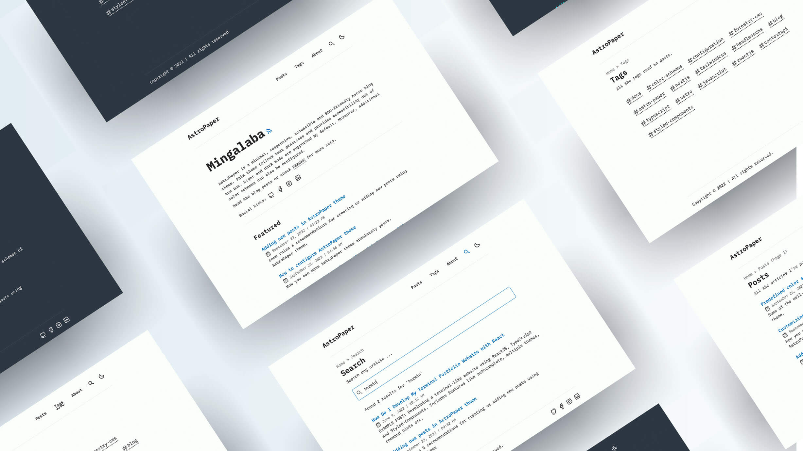

# Blog Template




A minimal, responsive, accessible and SEO-friendly blog template built with Astro.

## 🔥 Features

- [x] type-safe markdown
- [x] super fast performance
- [x] accessible (Keyboard/VoiceOver)
- [x] responsive (mobile ~ desktops)
- [x] SEO-friendly
- [x] light & dark mode
- [x] fuzzy search
- [x] draft posts & pagination
- [x] sitemap & rss feed
- [x] followed best practices
- [x] highly customizable
- [x] dynamic OG image generation for blog posts

## ✅ Lighthouse Score

<p align="center">
  <a href="https://pagespeed.web.dev/report?url=https%3A%2F%2Fastro-paper.pages.dev%2F&form_factor=desktop">
    
  <a>
</p>

## 🚀 Project Structure

Inside of this template, you'll see the following folders and files:

```bash
/
├── public/
│   ├── assets/
|   ├── pagefind/ # auto-generated when build
│   └── favicon.svg
│   └── astropaper-og.jpg
│   └── favicon.svg
│   └── toggle-theme.js
├── src/
│   ├── assets/
│   │   └── icons/
│   │   └── images/
│   ├── components/
│   ├── data/
│   │   └── blog/
│   │       └── some-blog-posts.md
│   ├── layouts/
│   └── pages/
│   └── styles/
│   └── utils/
│   └── config.ts
│   └── constants.ts
│   └── content.config.ts
└── astro.config.ts
```

Astro looks for `.astro` or `.md` files in the `src/pages/` directory. Each page is exposed as a route based on its file name.

Any static assets, like images, can be placed in the `public/` directory.

All blog posts are stored in `src/data/blog` directory.

## 💻 Tech Stack

**Main Framework** - [Astro](https://astro.build/)  
**Type Checking** - [TypeScript](https://www.typescriptlang.org/)  
**Styling** - [TailwindCSS](https://tailwindcss.com/)  
**Static Search** - [FuseJS](https://pagefind.app/)  
**Icons** - [Tablers](https://tabler-icons.io/)  
**Code Formatting** - [Prettier](https://prettier.io/)  
**Deployment** - [Cloudflare Pages](https://pages.cloudflare.com/)  
**Linting** - [ESLint](https://eslint.org)

## 👨🏻‍💻 Running Locally

You can start using this project locally by running the following command in your desired directory:

```bash
# pnpm
pnpm create astro@latest --template satnaing/astro-paper

# npm
npm create astro@latest -- --template satnaing/astro-paper

# yarn
yarn create astro --template satnaing/astro-paper

# bun
bun create astro@latest -- --template satnaing/astro-paper
```

Then start the project by running the following commands:

```bash
# install dependencies if you haven't done so in the previous step.
pnpm install

# start running the project
pnpm run dev
```

As an alternative approach, if you have Docker installed, you can use Docker to run this project locally. Here's how:

```bash
# Build the Docker image
docker build -t blog-template .

# Run the Docker container
docker run -p 4321:80 blog-template
```

## Google Site Verification (optional)

You can easily add your [Google Site Verification HTML tag](https://support.google.com/webmasters/answer/9008080#meta_tag_verification&zippy=%2Chtml-tag) in this template using an environment variable. This step is optional. If you don't add the following environment variable, the google-site-verification tag won't appear in the HTML `<head>` section.

```bash
# in your environment variable file (.env)
PUBLIC_GOOGLE_SITE_VERIFICATION=your-google-site-verification-value
```

## 🧞 Commands

All commands are run from the root of the project, from a terminal:

> **_Note!_** For `Docker` commands we must have it [installed](https://docs.docker.com/engine/install/) in your machine.

| Command                               | Action                                                                                                                           |
| :------------------------------------ | :------------------------------------------------------------------------------------------------------------------------------- |
| `pnpm install`                        | Installs dependencies                                                                                                            |
| `pnpm run dev`                        | Starts local dev server at `localhost:4321`                                                                                      |
| `pnpm run build`                      | Build your production site to `./dist/`                                                                                          |
| `pnpm run preview`                    | Preview your build locally, before deploying                                                                                     |
| `pnpm run format:check`               | Check code format with Prettier                                                                                                  |
| `pnpm run format`                     | Format codes with Prettier                                                                                                       |
| `pnpm run sync`                       | Generates TypeScript types for all Astro modules. [Learn more](https://docs.astro.build/en/reference/cli-reference/#astro-sync). |
| `pnpm run lint`                       | Lint with ESLint                                                                                                                 |
| `docker compose up -d`                | Run template on docker, You can access with the same hostname and port informed on `dev` command.                                |
| `docker compose run app npm install`  | You can run any command above into the docker container.                                                                         |
| `docker build -t blog-template .`     | Build Docker image for the template.                                                                                             |
| `docker run -p 4321:80 blog-template` | Run template on Docker. The website will be accessible at `http://localhost:4321`.                                               |

> **_Warning!_** Windows PowerShell users may need to install the [concurrently package](https://www.npmjs.com/package/concurrently) if they want to [run diagnostics](https://docs.astro.build/en/reference/cli-reference/#astro-check) during development (`astro check --watch & astro dev`). For more info, see [this issue](https://github.com/satnaing/astro-paper/issues/113).

## 📜 License

Licensed under the MIT License, Copyright © 2025
